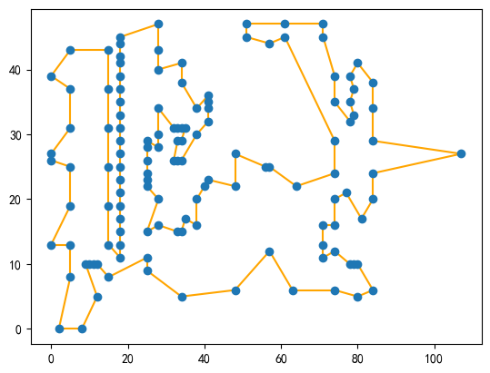
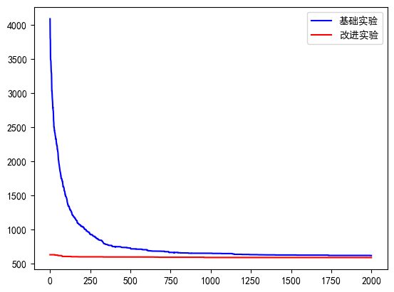

# TSP-GA

使用经典遗传算法求解TSP问题，并提供改进方案及实现。

内置计时器、路径可视化、迭代过程可视化、可修改的算子接口。

## 变量定义

+ `population_size`: 种群数量
+ `max_iteration`: 最大迭代次数
+ `crossover_probability`: 交叉概率
+ `mutate_probability`: 变异概率
+ `tournament_size`: 锦标赛选手数

## Usage

```python
ga = GA()
ga.read_file('./Data/xqf131.tsp')
ga.run()
ga.show_plot()
```

## 实现效果

可视化输出最优路径




## 改进

### 自适应交叉概率和变异概率改进

首先定义最小交叉概率Pcmin和最小变异概率Pmmin，以及最大交叉概率Pcmax和最大变异概率Pmmax。随着种群的进化，在每一轮次中，可以根据当前轮次中最优解的适应度来动态调整这些概率。

假设当前轮次的最优解的适应度为fmax，那么可以按照以下方式调整交叉概率Pc和变异概率Pm：

1. 对于每一个需要进行交叉或变异的个体i，计算适应度比例：fi = f/favg，其中f是每个个体的适应度。
2. 根据适应度比例调整交叉概率Pc： 
   + 当适应度比例大于1时，交叉概率不会发生变化，以确保较好的个体得以保留；
   + 当适应度比例小于1（即个体适应度相比中等适应度更差）时，Pc会增大，可以避免过度收敛到局部最优解。
3. 根据适应度比例调整变异概率Pm：
   + 与交叉概率类似，当适应度比例大于1时，Pm会减小，以确保较好的个体得以保留；
   + 当适应度比例小于1时，Pm会增加，以鼓励产生新个体。 

通过这种方式，根据每一轮次中的最优解来自适应地调整交叉概率和变异概率，从而确保种群不会陷入局部最优解并且较好的个体得以保留。

### 初始化种群的生成方式改进

使用贪心算法生成初始化种群的方式来取代随机生成初始化种群。通过使用贪心算法，我们可以在搜索空间中定位到一些有前途的区域，由此提高初始种群的质量。

在函数中，首先循环p次，每次随机生成一个起始节点，并调用贪心函数得到一条最优路径，把这条路径加入到种群中。最后返回生成的种群作为初始种群。


